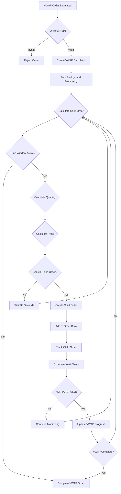

# 🚀 C++ Trading Engine

A high-performance, multi-threaded trading engine built in C++17 with support for various order types including VWAP, stop-limit, and trailing stop orders.


## �� Table of Contents
- [🚀 Quick Start](#-quick-start)
- [📊 Order Types](#-order-types)
- [🏗️ Architecture & Data Structures](#️-architecture--data-structures)
- [📈 VWAP Implementation](#-vwap-implementation)
- [🧪 Testing](#-testing)
- [🤝 Contributing](#-contributing)
- [📄 License](#-license)
- [🆘 Support](#-support)

## 🚀 Quick Start

### Prerequisites
- C++17 compatible compiler (GCC 7+ or Clang 5+)
- Make
- pthread support

### Build & Run
1. **Build the project:**
   ```bash
   make all
   ```
2. **Start the server first:**
   ```bash
   make run-server
   ```
3. **In a new terminal, start the client:**
   ```bash
   make run-client
   ```
4. **Run tests:**
   ```bash
   make run-test
   ```

⚠️ **Always start the server before the client!**

---

## 📊 Order Types

| Type           | Description                                      | Example                                      |
|----------------|--------------------------------------------------|----------------------------------------------|
| **LIMIT**      | Buy/sell at specific price or better             | `BUY 100 AAPL @ $150.00`                     |
| **MARKET**     | Buy/sell at current market price                 | `BUY 100 AAPL @ MARKET`                      |
| **STOP_LOSS**  | Becomes market order when stop price is hit      | `STOP_LOSS SELL 100 AAPL @ $145.00`          |
| **STOP_LIMIT** | Becomes limit order when stop price is hit       | `STOP_LIMIT BUY 100 AAPL @ $155.00 (trigger: $160.00)` |
| **TRAILING_STOP** | Stop order that trails price movement         | `TRAILING_STOP SELL 100 AAPL @ $5.00 trailing`|
| **VWAP**       | Volume Weighted Average Price order              | `VWAP BUY 1000 AAPL @ $150.00 (9:30-16:00)`  |

---

## 🏗️ Architecture & Data Structures

```
┌───────────────┐    ┌───────────────┐    ┌───────────────┐
│   Client      │    │   Server      │    │   Matching    │
│   (CLI)       │◄──►│   (Socket)    │◄──►│   Engine      │
└───────────────┘    └───────────────┘    └───────────────┘
                            │                   │
                            ▼                   ▼
                   ┌───────────────┐    ┌───────────────┐
                   │   Order Book  │    │   VWAP        │
                   │   (Per Symbol)│    │   Calculator  │
                   └───────────────┘    └───────────────┘
```

### Core Data Structures Used
- **std::map<double, vector<Order>>** — Price-ordered buy/sell orders
- **std::unordered_map** — Fast lookup by symbol, client, or order ID
- **std::vector** — Order lists, stop loss, child orders, trade history
- **std::queue** — Task queue for ThreadPool
- **std::vector<thread>** — Worker threads
- **std::atomic** — Thread-safe order ID counter
- **std::mutex, std::condition_variable** — Thread safety
- **std::shared_ptr** — Automatic memory management

### Thread Safety & Performance
- All shared data is protected by mutexes or atomics
- ThreadPool enables non-blocking, concurrent order processing
- Price-ordered maps and hash maps ensure efficient matching and lookup
- Memory is managed using smart pointers throughout

---

## 📈 VWAP Implementation

**VWAP (Volume Weighted Average Price)** orders break large orders into smaller child orders executed over time to achieve a target average price.

### 🎯 VWAP Flowchart


### VWAP Example
**Scenario:** Buy 1000 AAPL shares, Target VWAP: $150.00, Time: 9:30 AM - 4:00 PM
- Child Order 1: 100 shares @ $150.50 (9:30 AM)
- Child Order 2: 150 shares @ $150.20 (9:30:30 AM)
- Child Order 3: 200 shares @ $150.05 (10:00 AM)
- Child Order 4: 200 shares @ $150.10 (12:00 PM)
- Child Order 5: 350 shares @ $149.95 (3:45 PM)
- **Final VWAP:** $150.02 (0.013% deviation from target!)

**If a VWAP order is not fully executed by the end of its time window, no further child orders are placed and the remaining quantity is left unfilled.**

---

## 🧪 Testing

```bash
make run-test
```

Covers: order validation, matching, VWAP, stop-limit, trailing stop, market orders, cancellation.

---

## 🤝 Contributing
1. Fork the repository
2. Create a feature branch
3. Make your changes
4. Add tests
5. Submit a pull request

---

## 📄 License

This project is licensed under the MIT License - see the LICENSE file for details.

---

## 🆘 Support
- Create an issue on GitHub
- Check the test files for usage examples
- Review the architecture documentation

**Happy Trading! 🚀📈** 