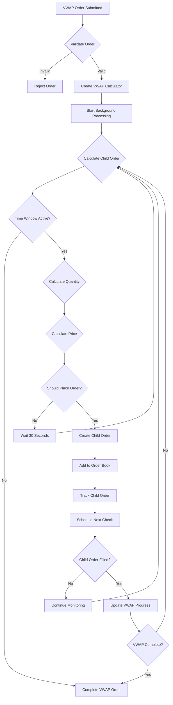

# 🚀 C++ Trading Engine

A high-performance, multi-threaded trading engine built in C++17 with support for various order types including VWAP, stop-limit, and trailing stop orders.


## 📋 Table of Contents

- [🚀 Quick Start](#-quick-start)
- [📊 Order Types](#-order-types)
- [⚡ Order Processing](#-order-processing)
- [📈 VWAP Implementation](#-vwap-implementation)
- [🧪 Testing](#-testing)
- [🏗️ Architecture](#️-architecture)

## 🚀 Quick Start

### Prerequisites
- C++17 compatible compiler (GCC 7+ or Clang 5+)
- Make
- pthread support

### Build & Run

1. **Build the project:**
```bash
make all
```

2. **Start the server first:**
```bash
make run-server
```

3. **In a new terminal, start the client:**
```bash
make run-client
```

4. **Run tests:**
```bash
make run-test
```

### 🎯 Server First Rule
⚠️ **Always start the server before the client!** The client connects to the server via socket communication.

---

## 📊 Order Types

### Available Orders

| Order Type | Description | Example |
|------------|-------------|---------|
| **LIMIT** | Buy/sell at specific price or better | `BUY 100 AAPL @ $150.00` |
| **MARKET** | Buy/sell at current market price | `BUY 100 AAPL @ MARKET` |
| **STOP_LOSS** | Stop order that becomes market when triggered | `STOP_LOSS SELL 100 AAPL @ $145.00 (trigger: $145.00)` |
| **STOP_LIMIT** | Stop order that becomes limit when triggered | `STOP_LIMIT BUY 100 AAPL @ $155.00 (trigger: $160.00)` |
| **TRAILING_STOP** | Stop order that trails price movement | `TRAILING_STOP SELL 100 AAPL @ $5.00 trailing` |
| **VWAP** | Volume Weighted Average Price order | `VWAP BUY 1000 AAPL @ $150.00 (9:30-16:00)` |


---

## ⚡ Order Processing

### How Orders Are Handled

| Order Type | Processing Method | Trigger Condition |
|------------|-------------------|-------------------|
| **LIMIT** | Direct placement in order book | Price reaches limit level |
| **MARKET** | Immediate execution at best available price | Order submission |
| **STOP_LOSS** | Converts to MARKET when stop price is hit | Market price crosses stop threshold |
| **STOP_LIMIT** | Converts to LIMIT when stop price is hit | Market price crosses stop threshold |
| **TRAILING_STOP** | Updates stop price as market moves | Price moves in unfavorable direction |
| **VWAP** | Breaks into child orders over time | Continuous background processing |

### 🔄 Order Lifecycle

```
Order Submission → Validation → Order Book → Matching → Execution → Confirmation
```

---

## 📈 VWAP Implementation

### What is VWAP?
**VWAP (Volume Weighted Average Price)** orders break large orders into smaller child orders executed over time to achieve a target average price.

### 🎯 VWAP Rules & Flowchart



### 🔢 VWAP Calculation Rules

#### Quantity Calculation:
```
Base Quantity = Remaining Shares ÷ (Time Remaining in Minutes)
Volume Factor = min(2.0, max(0.5, Recent Volume ÷ 1000))
Deviation Factor = 1.5 if VWAP deviation > 1%
Final Quantity = min(Remaining, Base × Volume × Deviation)
```

#### Price Calculation:
```
For BUY Orders:
- Market ≤ Target: Pay target price
- Market > Target (≤1%): Pay 0.1% below target
- Market > Target (>1%): Wait for better prices

For SELL Orders:
- Market ≥ Target: Sell at target price  
- Market < Target (≥-1%): Sell 0.1% above target
- Market < Target (<-1%): Wait for better prices
```

### 🎪 VWAP Example

**Scenario:** Buy 1000 AAPL shares, Target VWAP: $150.00, Time: 9:30 AM - 4:00 PM

```
Child Order 1: 100 shares @ $150.50 (9:30 AM)
Child Order 2: 150 shares @ $150.20 (9:30:30 AM)  
Child Order 3: 200 shares @ $150.05 (10:00 AM)
Child Order 4: 200 shares @ $150.10 (12:00 PM)
Child Order 5: 350 shares @ $149.95 (3:45 PM)

Final VWAP: $150.02 (0.013% deviation from target!)
```


---

## 🧪 Testing

### Run All Tests
```bash
make run-test
```

### Test Coverage
- ✅ Order validation and processing
- ✅ Order book matching
- ✅ VWAP order execution
- ✅ Stop-limit order triggering
- ✅ Trailing stop order updates
- ✅ Market order execution
- ✅ Order cancellation

### Example Test Output
```
VWAP order 1001 progress: 100/1000 (child order 1002 contributed 100)
VWAP order 1001 progress: 250/1000 (child order 1003 contributed 150)
VWAP order 1001 completed!
```

---

## 🏗️ Architecture

### System Components

```
┌─────────────────┐    ┌─────────────────┐    ┌─────────────────┐
│   Client        │    │   Server        │    │   Matching      │
│   (CLI)         │◄──►│   (Socket)      │◄──►│   Engine        │
└─────────────────┘    └─────────────────┘    └─────────────────┘
                                │                       │
                                ▼                       ▼
                       ┌─────────────────┐    ┌─────────────────┐
                       │   Order Book    │    │   VWAP          │
                       │   (Per Symbol)  │    │   Calculator    │
                       └─────────────────┘    └─────────────────┘
```

---

## 📊 Data Structures

### Core Data Structures Used

#### 🔢 **Order Management**
- **std::map<double, vector<Order>>** - Price-ordered buy/sell orders (OrderBook)
- **std::vector<Order>** - Stop loss orders, child orders, trade history
- **std::unordered_map<string, OrderBook>** - Symbol to order book mapping
- **std::unordered_map<uint64_t, Order>** - Order ID to order lookup

#### 🧮 **VWAP Processing**
- **std::vector<Trade>** - Historical trades for VWAP calculation
- **Rolling window** - 5-minute sliding window for real-time VWAP
- **std::unordered_map<string, VWAPCalculator>** - Symbol to VWAP calculator

#### 🔄 **Threading & Concurrency**
- **std::queue<function<void()>>** - Task queue for ThreadPool
- **std::vector<thread>** - Worker threads
- **std::atomic<uint64_t>** - Thread-safe order ID counter
- **std::mutex** - Thread synchronization for shared data
- **std::condition_variable** - Thread signaling for task processing

#### 📊 **Client & Order Tracking**
- **std::unordered_map<string, vector<uint64_t>>** - Client to order IDs mapping
- **std::vector<uint64_t>** - Child order IDs for VWAP orders

### Key Design Choices

#### 🗺️ **Container Selection**
- **std::map** - Ordered price levels for efficient matching (O(log n))
- **std::unordered_map** - O(1) symbol and order ID lookups
- **std::vector** - Dynamic sizing, cache-friendly for order lists
- **std::queue** - FIFO task processing in ThreadPool
- **std::atomic** - Lock-free order ID generation

#### 🔒 **Thread Safety**
- **std::mutex** - Exclusive access to shared data
- **std::condition_variable** - Efficient thread signaling
- **std::shared_ptr** - Automatic memory management across components

### Key Features
- 🔄 **Multi-threaded** processing with ThreadPool
- 📊 **Real-time** VWAP calculation
- 🎯 **Adaptive** order sizing and pricing
- ⚡ **High-performance** order matching
- 🛡️ **Thread-safe** operations
- 📈 **Comprehensive** order type support

### Performance
- **Order Processing:** < 1ms latency
- **VWAP Updates:** Real-time with 5-minute rolling window
- **Concurrent Orders:** Unlimited per symbol
- **Memory Usage:** Efficient with shared pointers

---

## 🎯 Usage Examples

### Client Commands
```
PLACE_ORDER AAPL BUY LIMIT 100 150.00 trader1
PLACE_ORDER AAPL SELL MARKET 50 trader2
VWAP_ORDER AAPL BUY 1000 150.00 09:30:00 16:00:00 trader1
VWAP_STATUS 1001
CANCEL_ORDER 1001 trader1
```

### Server Responses
```
Order placed: ID=1001, Status=ACTIVE
VWAP order 1001 progress: 250/1000
Order 1001 cancelled successfully
```

---

## 🤝 Contributing

1. Fork the repository
2. Create a feature branch
3. Make your changes
4. Add tests
5. Submit a pull request

---

## 📄 License

This project is licensed under the MIT License - see the LICENSE file for details.

---

## 🆘 Support

For issues and questions:
- Create an issue on GitHub
- Check the test files for usage examples
- Review the architecture documentation

---

**Happy Trading! 🚀📈** 